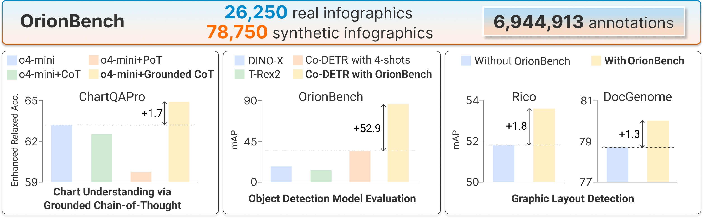

## MMDetection
Please follow the instructions in [MMDetection](./mmdetection) to set up the environment first.  

There are four models training and testing on MMDetection:  
[Faster-Rcnn](./mmdetection/configs/faster_rcnn/faster-rcnn_my_full.py), [YOLOv3](./mmdetection/configs/yolo/yolov3_my_full.py), [RTMDet](./mmdetection/configs/rtmdet/rtmdet_my_full.py) and [Co-DETR](./mmdetection/projects/CO-DETR/configs/codino/co_dino_my_full.py)

Modify "YOUR ROOT" and "YOUR DATASET" in these four config files.

Run the code to train the model:
```
cd mmdetection
bash tools/dist_train.sh configs/faster_rcnn/faster-rcnn_my_full.py 8 --cfg-options data.samples_per_gpu=1 optimizer_config.cumulative_iters=8 optimizer_config.type="GradientCumulativeOptimizerHook" --work-dir work_dir/faster-rcnn_my_full
bash tools/dist_train.sh configs/yolo/yolov3_my_full.py 8 --cfg-options data.samples_per_gpu=1 optimizer_config.cumulative_iters=8 optimizer_config.type="GradientCumulativeOptimizerHook" --work-dir work_dir/yolov3_my_full
bash tools/dist_train.sh configs/rtmdet/rtmdet_my_full_new.py 8 --cfg-options data.samples_per_gpu=1 optimizer_config.cumulative_iters=8 optimizer_config.type="GradientCumulativeOptimizerHook" --work-dir work_dir/rtmdet_my_full
bash tools/dist_train.sh projects/CO-DETR/configs/codino/co_dino_my_full.py 8 --cfg-options data.samples_per_gpu=1 optimizer_config.cumulative_iters=8 optimizer_config.type="GradientCumulativeOptimizerHook" --work-dir work_dir/codetr_my_full
```