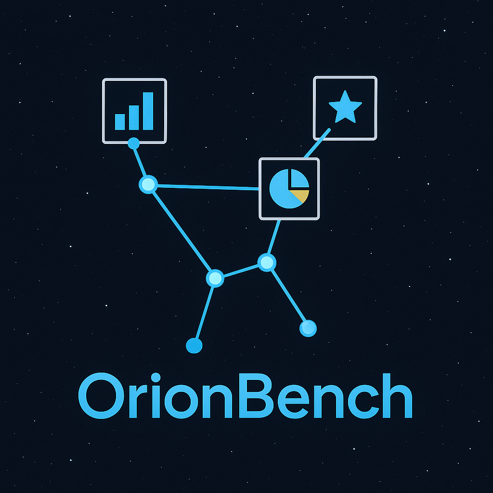
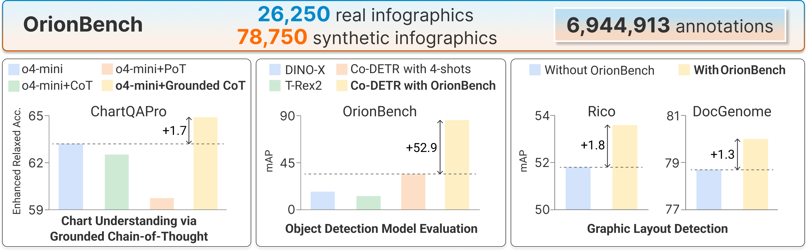
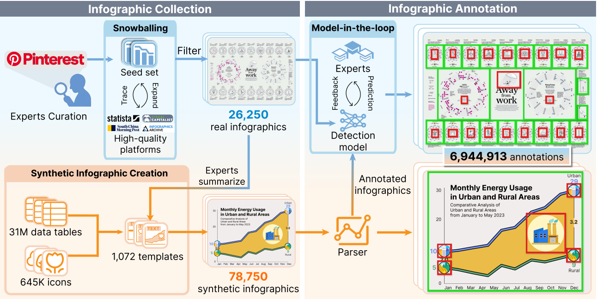
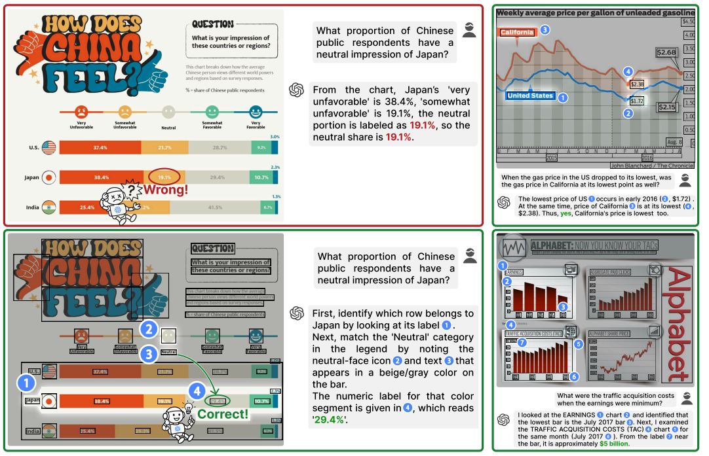
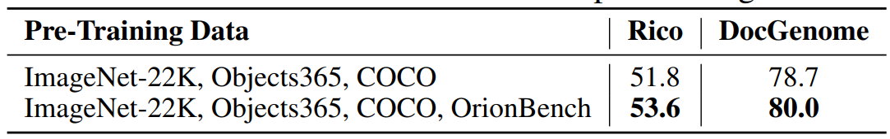

<div align=center>
  
</div>

<h1>
  OrionBench: A Benchmark for Chart and Human-Recognizable Object Detection in Infographics
</h1>

<p align="center">
  <a href="https://arxiv.org/abs/2505.17473">
    
  </a>
  <a href="https://huggingface.co/datasets/OrionBench/OrionBench">
    
  </a>
</p>

> OrionBench is a benchmark designed to support the development of accurate object detection models for charts and HROs in infographics. It contains 26,250 real and 78,750 synthetic infographics, with over 6.9 million bounding box annotations.



## 🔥 News
[2025.5] 🎉🎉 We have released the first version of our benchmark, which includes 26,250 real and 78,750 synthetic infographic charts, with over 6.9 million bounding box annotations.

## 📦 Benchmark
**[👉 Access the full OrionBench benchmark on Hugging Face 🤗! 👈](https://huggingface.co/datasets/OrionBench/OrionBench)**

OrionBench comprises a diverse collection of infographics from two sources: 1) real infographics collected from 7 online platforms, and 2) synthetic infographics programmatically created from 1,072 design templates.
To effectively annotate the infographics, we combine the model-in-the-loop and programmatic methods.



## 🎯 Applications

The effectiveness of OrionBench is demonstrated through three applications:

### Thinking-with-Boxes via Grounded Chain-of-Thought

We construct a Thinking-with-Boxes scheme to enhance VLMs by explicitly providing grounded annotations of texts, charts, and HROs along with additional layered infographic images.
For more details, please refer to this [folder](grounded_CoT). 




### Evaluating Object Detection Models

We compare 11 object detection models on OrionBench to assess their performance in detecting charts and HROs. 
The following figure shows detection results of evaluated object detection models: (a) zero-shot prompting with DINO-X; (b) 4-shot prompting with T-Rex2; (c) 4-shot fine-tuning with Co-DETR; (d) fine-tuning on OrionBench with Co-DETR. Bounding boxes in colors are the predictions for charts and HROs.
For more details, please refer to this [folder](model_evaluation). 


### Applying the Developed Model to Graphic Layout Detection

To demonstrate the broader applicability of OrionBench, we evaluate its effectiveness on graphic layout detection tasks by applying the InternImage-based model.
For more details, please refer to this [folder](graphic_layout_detection). 





## ⚖️ License
This project is released under the [Apache 2.0 license](LICENSE).

## 📚 Citation
If you find our work helpful for your research, please consider citing the following BibTeX entry.
```
@misc{zhu2025orionbench,
      title={OrionBench: A Benchmark for Chart and Human-Recognizable Object Detection in Infographics}, 
      author={Jiangning Zhu and Yuxing Zhou and Zheng Wang and Juntao Yao and Yima Gu and Yuhui Yuan and Shixia Liu},
      year={2025},
      eprint={2505.17473},
      archivePrefix={arXiv},
      primaryClass={cs.CV},
      url={https://arxiv.org/abs/2505.17473}, 
}
```

## ✨ Related Projects
- **ChartGalaxy: A Dataset for Infographic Chart Understanding and Generation**  
[Paper](https://arxiv.org/abs/2505.18668) | [Code](https://github.com/ChartGalaxy/ChartGalaxy) | [Dataset](https://huggingface.co/datasets/ChartGalaxy/ChartGalaxy)

- **InfoChartQA: A Benchmark for Multimodal Question Answering on Infographic Charts**  
[Paper](https://arxiv.org/abs/2505.19028) | [Code](https://github.com/CoolDawnAnt/InfoChartQA) | [Dataset](https://huggingface.co/datasets/Jietson/InfoChartQA)


## 🤝 Contact
- OrionBench2025@gmail.com
